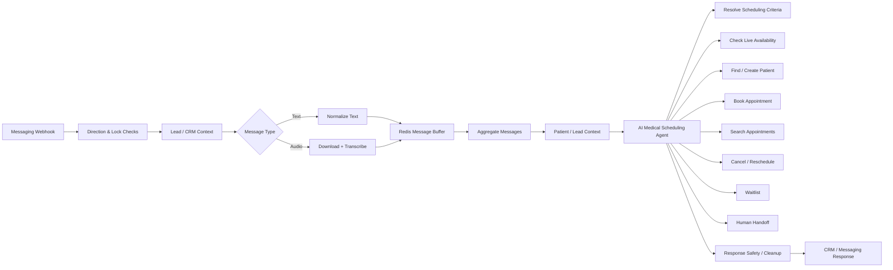
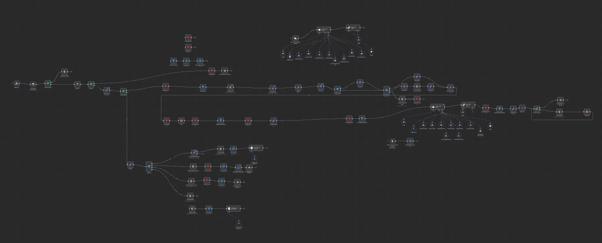
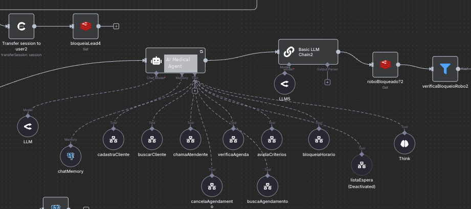
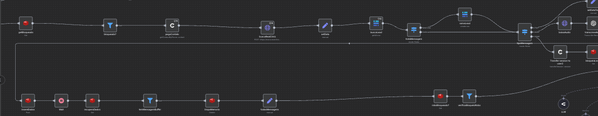

# AI Medical Scheduling & Patient Service Agent

A production-inspired **n8n AI automation portfolio project** that orchestrates medical
appointment scheduling, patient lookup, cancellations, rescheduling, waitlists and human handoff.

> This repository contains a sanitized public version of a real production architecture.
> Client identity, patient data, credentials, internal IDs, private endpoints, doctor names,
> insurance-specific business rules and proprietary policies were removed or replaced.

## Production context

The original system was designed for a medical-clinic operation receiving **100+ inbound
messages per day**, with automation handling the scheduling journey end to end and humans
focused on exceptions and follow-up.

## What the system demonstrates

- AI-powered patient intake and scheduling
- Text and audio message processing
- Audio transcription before agent processing
- Redis-based message buffering for rapid consecutive messages
- Persistent conversational memory
- Lead/customer state management
- Patient lookup against an external clinic-management platform
- Live scheduling-criteria resolution
- Live appointment availability lookup
- Patient creation / identification
- Appointment booking with re-validation before the transactional action
- Appointment search and cancellation
- Rescheduling orchestration
- Waitlist workflow
- CRM / messaging integration
- Human handoff for exceptions and sensitive cases
- Output-cleaning / guardrail chains
- Reusable linked sub-workflow architecture

## High-level architecture

## Core stack

- **n8n**
- **AI Agents / LLMs**
- **OpenAI / OpenRouter-style LLM integrations**
- **REST APIs**
- **Webhooks**
- **Redis**
- **PostgreSQL conversational memory**
- **CRM / messaging integration**
- **JSON / JavaScript expressions**
- External clinic-management / scheduling APIs

## Why the linked sub-workflows are not included

The production system uses multiple reusable sub-workflows for actions such as:

- scheduling-criteria resolution
- live availability lookup
- patient creation and lookup
- appointment booking
- appointment search
- cancellation
- waitlist registration
- human handoff

They are represented in the public workflow as **placeholder linked workflows**.

Publishing every production sub-workflow would add unnecessary client-specific implementation
details and increase confidentiality risk. The goal of this repository is to demonstrate
**architecture, orchestration, AI tool use, integrations, state handling and production thinking**.

See [`docs/SUBWORKFLOWS.md`](docs/SUBWORKFLOWS.md).

## Public workflow

The sanitized n8n export is available here:

[`workflow/ai-medical-scheduling-agent-public.json`](workflow/ai-medical-scheduling-agent-public.json)

It can be imported into n8n for architecture review.

It is **not expected to run out of the box**. Credentials, production endpoints and linked
sub-workflow IDs were intentionally removed.

## Workflow screenshots

### 1. End-to-end workflow overview

The orchestration combines inbound messaging, state control, CRM/patient context, AI-agent
decisioning, reusable scheduling tools, safety checks and outbound messaging.

### 2. AI agent and transactional tools

The central agent uses persistent memory and specialized tools for patient lookup/creation,
availability checks, scheduling criteria, booking, appointment search/cancellation and
human escalation.

### 3. Message processing, CRM context and buffering

Inbound events pass through direction/lock checks, CRM context retrieval and message routing.
Rapid consecutive messages are buffered with Redis before agent execution; audio messages can
be downloaded and transcribed before joining the same processing pipeline.

## Reliability principles demonstrated

The architecture follows several production-oriented patterns:

1. transactional actions depend on tool responses rather than LLM-generated facts;
2. availability is re-checked before booking;
3. conversation state is preserved;
4. rapid consecutive messages are buffered before agent execution;
5. uncertain or sensitive cases are escalated to humans;
6. booking/cancellation actions are isolated in reusable workflows;
7. response-cleaning stages reduce accidental internal/meta output.

## Author

**Glaucio Navarro**  
AI Automation Engineer  
LinkedIn: https://www.linkedin.com/in/glaucionavarro/
